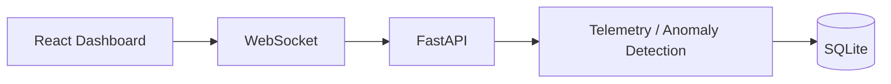

# Pulse — Real-Time System Monitoring Platform

Pulse is a local system-monitoring demo built with React and FastAPI. It streams
**simulated** CPU, memory, temperature, and network metrics to a live dashboard,
flags threshold violations, and stores incident transitions in SQLite. It does
not read actual hardware or operating-system metrics.

## Key features

- Four live metric cards with threshold-based highlighting.
- Responsive Recharts line charts showing the most recent 60 telemetry samples.
- WebSocket updates approximately once per second, with a Live/Disconnected indicator.
- Automatic reconnection two seconds after a socket closes, with socket and timer cleanup.
- A browser-session Incident Feed retaining the latest 10 anomalous messages.
- Persistent SQLite incidents recorded on normal-to-abnormal transitions.
- HTTP endpoints for health, a telemetry snapshot, and the latest 20 saved incidents.

## Architecture



The diagram shows the components from dashboard to storage. Telemetry responses
travel back from FastAPI to the dashboard over the WebSocket connection.

```text
backend/
  main.py             API routes, simulation, anomaly checks, SQLite storage
  requirements.txt    Backend runtime dependencies
  pulse.db            Created at startup; excluded from Git
frontend/
  src/App.tsx         Dashboard, WebSocket lifecycle, charts, incident feed
  src/App.css         Dashboard styles
  src/index.css       Global styles
  package.json        Frontend dependencies and scripts
  package-lock.json   Locked frontend dependency versions
```

## Technology stack

| Layer | Technologies |
| --- | --- |
| Dashboard | React, TypeScript, CSS, Recharts |
| Frontend tooling | Vite, Oxlint, npm |
| API and streaming | Python, FastAPI, Uvicorn, WebSockets |
| Storage | SQLite through Python's built-in `sqlite3` module; no ORM |

## WebSocket telemetry pipeline

1. The dashboard connects to `ws://127.0.0.1:8000/ws/telemetry`.
2. FastAPI generates a sample, evaluates thresholds, and saves new incident transitions.
3. The server sends JSON immediately and waits one second before generating the next sample.
4. React validates messages and updates the cards. Each valid sample receives a
   browser receipt timestamp and is appended using `[...previous, sample].slice(-60)`.
   All four charts share this rolling history.
5. Each anomalous message adds one feed entry combining its alerts, retaining
   only the latest 10 entries. On disconnection, the last values and history remain
   visible while the client waits two seconds to reconnect.

Example message:

```json
{
  "cpu": 94.2,
  "memory": 61.3,
  "temperature": 58.4,
  "network": 22.1,
  "anomaly": true,
  "alerts": ["High CPU usage"]
}
```

Each WebSocket connection generates its own samples; there is no shared broadcast
or background collector. `GET /telemetry` also generates a fresh sample and runs
the same detection and persistence logic. Without requests or connected clients,
no telemetry is generated.

## Anomaly detection

Detection uses fixed thresholds, not machine learning:

| Metric | Abnormal when | Alert |
| --- | --- | --- |
| CPU | > 85% | High CPU usage |
| Memory | > 90% | High memory usage |
| Temperature | > 80°C | High temperature |
| Network | > 90 Mbps | High network usage |

Values equal to a threshold are normal. Normal samples stay below these limits;
roughly 20% of samples include a spike in one randomly selected metric.
Every sample contains an `anomaly` boolean and an `alerts` array, even when empty.

## SQLite incident persistence

On startup, FastAPI creates `backend/pulse.db` and an `incidents` table if needed.
Each row contains `id`, a UTC ISO 8601 `timestamp`, `metric`, numeric `value`, and
`message`. Parameterized inserts are committed through `sqlite3`.

An in-memory set tracks which metrics were abnormal in the preceding processed
sample. A metric is inserted only when it is abnormal now and absent from that
set. Returning to normal removes it, allowing a future crossing to create another
incident. A lock serializes transition checks and writes within the process.

This state is shared across HTTP requests and WebSocket connections in one
backend process. It resets on restart; database records persist. Run a single
worker for this demo. Independent clients produce independent samples but share
transition state, so this is not per-device or per-client incident tracking.

The dashboard feed is separate from saved incidents: it records every anomalous
WebSocket message in memory and does **not** fetch `/incidents`. Reloading the
page clears the feed and chart history, but does not delete SQLite records.

## Local setup

Prerequisites: Python 3.11+ and Node.js 22.12+ with npm. Commands below start from
the repository root and use two terminals. No root npm install is needed.

### Backend

```bash
cd backend
python3 -m venv venv
source venv/bin/activate
python -m pip install -r requirements.txt
python -m uvicorn main:app --reload --host 127.0.0.1 --port 8000
```

On Windows, use `python` instead of `python3` and activate with
`venv\Scripts\Activate.ps1` in PowerShell. SQLite is included with Python;
`websockets` supplies Uvicorn's WebSocket protocol support.

The database is created beside `main.py` automatically. Interactive API docs are
available at [localhost:8000/docs](http://127.0.0.1:8000/docs).

### Frontend

In a second terminal, from the repository root:

```bash
cd frontend
npm ci
npm run dev
```

Open the local URL printed by Vite (normally
[localhost:5173](http://localhost:5173)). Keep the backend on port 8000: the
WebSocket URL is currently hardcoded in `frontend/src/App.tsx`.

### Development checks

From `frontend/`:

```bash
npm run lint
npm run build
npm run preview
```

`build` runs TypeScript checks and emits `frontend/dist/`. `preview` serves that
build locally; the backend must still run separately. The Recharts bundle may
trigger Vite's advisory chunk-size warning.

### API reference

| Method | Path | Behavior |
| --- | --- | --- |
| GET | `/health` | Returns `{"status":"ok"}` |
| GET | `/telemetry` | Generates a sample, detects anomalies, records transitions |
| GET | `/incidents` | Returns up to 20 saved incident rows, newest IDs first |
| WebSocket | `/ws/telemetry` | Streams simulated JSON telemetry approximately once per second |

Quick checks with the backend running:

```bash
curl http://127.0.0.1:8000/health
curl http://127.0.0.1:8000/telemetry
curl http://127.0.0.1:8000/incidents
```

## Screenshot

_Add a screenshot of the running Pulse dashboard here._

<!-- Once the image exists, replace the placeholder with:

-->

## Current scope

Pulse is a local demonstration with simulated telemetry, fixed thresholds, and
local SQLite storage. It does not include real host monitoring, authentication,
multi-host aggregation, notifications, or a production deployment configuration.
